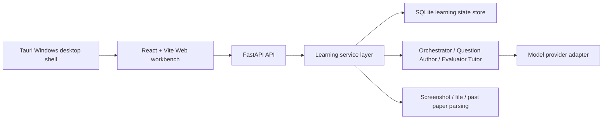

# Lang Drill Agent

> Language: [简体中文](README.md) | [English](README.en.md) | [日本語](README.ja.md)

Lang Drill Agent is a local study workbench for language exam preparation. Its core goal is to close the gap between vocabulary memorization and exam drilling.

Many learning tools split word lists, practice, mistakes, explanations and statistics into separate workflows: after memorizing words you still have to find questions manually, and after answering it is hard to trace back to specific vocabulary and weak points. Lang Drill Agent chains word list import, question set generation, question by question answering, evaluation and explanation, mistake reflow and learning statistics into one loop, so every word entry can enter real practice and every answer can feed later review.

The project focuses on exams such as CET-4/CET-6, CFT-4, CJT4/CJT6 and other language tests. Formal learning state is persisted in SQLite. Models generate questions and explanations; the program persists questions, scores answers, advances progress and computes statistics, so learning records never drift inside chat context.

Both a Web edition and a Windows desktop edition are provided. The desktop edition wraps the same React/Vite UI with Tauri and starts a local FastAPI backend; the Web development workflow stays unchanged. The current experimental release is `v1.0.1`; `v1.0.0-alpha.2` remains available as the historical v1.0.0-series build.

## Core Features

- Three column study workbench: left learning status, center chat and question cards, right branch, phone mirror and screenshot import.
- Word list to drilling loop: importing a word list auto generates an exam style question set, shown one by one, scored and advanced.
- Screenshot and file import: supports phone vocabulary screenshot OCR, TXT, Markdown, PDF, DOCX and image text extraction.
- Exam style question types: prefers English context sentences, cloze blanks, reading context questions and paraphrase, avoiding degeneration into pure Chinese gloss selection.
- Personalized explanation: after answering, the model combines the current question, user background, custom instructions and session context to generate an explanation.
- Learning statistics: shows questions completed, words mastered, accuracy, exam countdown, token usage and context capacity.
- Model configuration: supports OpenAI/GPT, Claude, DeepSeek, MiMo and custom OpenAI compatible providers.
- Daily review: typing "summarize" or "review" makes the model generate a study review based on the day's questions, answers, mistakes and chat history.
- Past paper reference: maintains a three year past paper index and local import assets per exam, referencing question types and style summaries during question generation, without publishing copyrighted full papers.

## Creative Mode (Optional · Experimental)

Creative mode is an optional experimental agent capability, off by default, that does not affect normal drilling and learning. When enabled it can invoke the local Pi runtime to perform general tasks such as directory organization and file operations, with three permission profiles: request approval, smart approval and full access.

> ⚠️ Warning: creative mode's general permissions can modify local files. Enable it only after understanding the risks, and prefer the request approval profile. Creative mode is still experimental; when the model is unavailable it falls back to local rule based generation and never blocks formal learning.

## Knowledge Base and Memory

- Knowledge base (RAG): users can import local documents to build a knowledge base; answer explanations and branch conversations can cite knowledge base sources with verifiable provenance.
- Layered memory: maintains user profile, learning goals, weak points and long term preferences for personalized question generation and explanation; memory is persisted in the local database and can be viewed and cleared in settings.

## Past Paper Copyright Boundary

Past paper assets are local references only: by default only exam indices and short excerpts are kept, full paper files are stored in the user's local `papers/<exam>/raw` directory and never enter the default release assets. The question author references past paper question types and style and does not reproduce or quote long passages of full papers. Users must ensure imported past paper content complies with copyright and usage licenses.

## Architecture



Core entry points:

- Frontend: [frontend/src/App.tsx](frontend/src/App.tsx)
- Backend API: [backend/langdrill_agent/api.py](backend/langdrill_agent/api.py)
- Agent implementation: [backend/langdrill_agent/agents.py](backend/langdrill_agent/agents.py)
- Service layer: [backend/langdrill_agent/services.py](backend/langdrill_agent/services.py)
- Desktop shell: [src-tauri/](src-tauri/)
- Tests: [try/](try/)

## Installation and Local Run

Web development mode:

```powershell
py -m venv .venv
.\.venv\Scripts\Activate.ps1
pip install -e .[dev]
cd frontend
npm install
cd ..
.\start.bat
```

Visit:

```text
http://127.0.0.1:5173
```

Stop services:

```powershell
.\stop.bat
```

Real API keys must only be written to the local `.env` file and never committed. See [.env.example](.env.example) for variable names.

## Web and Desktop Usage

The Web edition targets development and daily use; the desktop edition targets Windows users. After installation the desktop edition auto starts a local backend; user config, database, logs and `papers` are written to `%APPDATA%\Lang Drill Agent` and do not pollute the Web development environment. Both modes share the same frontend and backend business capabilities.

The UI supports Simplified Chinese, English and Japanese; switch in Settings → Language. The interface language only affects shell copy, not the language of model replies, questions or custom instructions.

## Product Demo Site

The standalone demo site currently uses [演示web2](演示web2) as the GitHub Pages source and does not modify the main `frontend/`. It introduces Lang Drill Agent's core loop, with system following dual themes, a dynamic word galaxy, a scrolling question generation demo, a sanitized screenshot gallery, GitHub and installer entry points, and an explorable three column workbench simulator.

```powershell
cd 演示web2
npm install
npm run dev
npm run build
```

The site is a static frontend built and deployed to GitHub Pages by `.github/workflows/pages-demo-web2.yml` at `https://q2955161835-debug.github.io/lang-drill-agent/`. Its download area only lists stable `v0.1.2` and current experimental `v1.0.1`; the header and home-page download actions default to the stable build. The online experience remains experimental. Historical builds remain available on GitHub Releases but are not shown on the demo site. The demo workbench does not connect to a real backend, does not read `.env`, and model replies are fixed mock content.

## Windows Installer and Update

The current Windows installer is published on GitHub Release:

- Stable `v0.1.2`: [release](https://github.com/q2955161835-debug/lang-drill-agent/releases/tag/v0.1.2) · [installer](https://github.com/q2955161835-debug/lang-drill-agent/releases/download/v0.1.2/Lang.Drill.Agent_0.1.2_x64-setup.exe)
- Current experimental `v1.0.1`: [release](https://github.com/q2955161835-debug/lang-drill-agent/releases/tag/v1.0.1) · [installer](https://github.com/q2955161835-debug/lang-drill-agent/releases/download/v1.0.1/Lang.Drill.Agent_1.0.1_x64-setup.exe)
- Historical v1.0.0-series build `v1.0.0-alpha.2`: [release](https://github.com/q2955161835-debug/lang-drill-agent/releases/tag/v1.0.0-alpha.2) · [installer](https://github.com/q2955161835-debug/lang-drill-agent/releases/download/v1.0.0-alpha.2/Lang.Drill.Agent_1.0.0-alpha.2_x64-setup.exe)
- SHA256 values are published in each Release's `checksums.sha256` attachment.

This is an unsigned internal test installer. Windows may warn about an unknown publisher; confirm the source and continue.

The install directory must use an English/ASCII path, for example `C:\LangDrillAgent` or `D:\LangDrillAgent`; choosing a Chinese or other non ASCII path aborts the installer with a prompt to change directory.

The desktop edition plans to integrate the official Tauri updater plugin, checking and installing updates via a signed `latest.json` manifest; the signing private key is stored only in GitHub Actions Secrets. Update check and install are both user initiated; on failure you can retry and view logs.

To build the installer yourself:

```powershell
powershell.exe -NoProfile -ExecutionPolicy Bypass -File scripts\desktop\build-desktop.ps1 -SkipInstall
```

## Verification

```powershell
py -m pytest tests -q
py -m ruff check backend tests scripts
cd frontend
npm run build
npm run test -- --run
cd ..
npm --prefix runtime/pi-bridge test
cargo check --manifest-path src-tauri\Cargo.toml
```

GitHub Actions CI is configured. Pushes and pull requests run Python lint, backend tests, the frontend build, frontend Vitest tests, pi-bridge tests and `cargo check` for the desktop shell. The desktop installer can be verified on a Windows VM via the manually triggered `Desktop Installer VM Test`.

## Experimental Status

The current version `v1.0.1` is an experimental pre release: creative mode, the signed update center, the trilingual UI and demo site sync are all experimental capabilities and may be unstable. The formal learning flow (word list import, question generation, answering, explanation, review) remains stable. `v1.0.0-alpha.2` is now historical; back up `%APPDATA%\Lang Drill Agent` before upgrading and reinstall that build or stable `v0.1.2` to roll back.

## License

This is a source available project. Non commercial use is licensed under the PolyForm Noncommercial License 1.0.0; commercial use requires a separate written commercial license. See [LICENSE](LICENSE) and [COMMERCIAL.md](COMMERCIAL.md).
