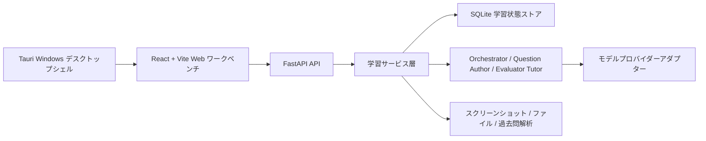

# Lang Drill Agent

> 言語：[简体中文](README.md) | [English](README.en.md) | [日本語](README.ja.md)

Lang Drill Agent は、語学試験対策向けのローカル学習ワークベンチです。主な目的は「単語暗記と問題演習の分離」を解決することです。

多くの学習ツールは単語リスト、問題演習、復習、解説、統計を別々のワークフローに分けています。単語を暗記しても手動で問題を探す必要があり、問題を解き終えても具体的な単語や弱点に戻りにくいです。Lang Drill Agent は単語リストのインポート、問題セットの生成、1問ずつの回答、採点と解説、誤答の回収、学習統計を一つのループにつなぎ、各単語を実際の練習に取り込み、各回答をその後の復習に活かします。

本プロジェクトは CET-4/CET-6、CFT-4、CJT4/CJT6 などの語学試験に重点を置いています。正式な学習状態は SQLite に保存されます。モデルは問題と解説を生成し、プログラムは問題の保存、採点、進捗の推进、統計を担当するため、学習記録がチャットのコンテキストに散逸しません。

Web 版と Windows デスクトップ版の両方を提供しています。デスクトップ版は同じ React/Vite UI を Tauri で包み、ローカル FastAPI バックエンドを起動します。Web 開発の起動方法は変更されません。現在のバージョンは `v1.0.0-experimental.1` です。デフォルトの学習フローは変更されず、クリエイティブモードはオプションの実験的機能です。

## 主な機能

- 三カラム学習ワークベンチ：左側に学習ステータス、中央にチャットと問題カード、右側にブランチ、スマホミラー、スクリーンショットインポート。
- 単語リストから演習までのループ：単語リストをインポートすると試験形式の問題セットを自動生成し、1問ずつ表示、採点、次の問題へ推进します。
- スクリーンショットとファイルのインポート：スマホの単語スクリーンショット OCR、TXT、Markdown、PDF、DOCX、画像のテキスト抽出に対応。
- 試験形式の問題タイプ：英文コンテキスト文、クローズブランク、読解コンテキスト問題、言い換えを優先し、単純な中国語訳選択への退化を防ぎます。
- 個別解説：回答後、モデルが現在の問題、ユーザー背景、カスタム指示、セッションコンテキストを組み合わせて解説を生成します。
- 学習統計：問題完了数、習得単語数、正答率、試験カウントダウン、トークン使用量、コンテキスト容量を表示。
- モデル設定：OpenAI/GPT、Claude、DeepSeek、MiMo、カスタム OpenAI 互換プロバイダーに対応。
- 毎日復習：「まとめ」や「復習」と入力すると、モデルが当日の問題、回答、誤答、チャット履歴に基づいて学習復習を生成します。
- 過去問参考：試験ごとに過去3年間の過去問インデックスとローカルインポート資産を管理し、問題生成時に問題タイプとスタイル要約を参考にし、著作権不明の完全な過去問は公開しません。

## クリエイティブモード（オプション · 実験的）

クリエイティブモードはオプションの実験的エージェント機能で、デフォルトはオフです。通常の演習や学習に影響しません。有効にすると、ローカル Pi ランタイムを呼び出してディレクトリ整理やファイル操作などの一般タスクを実行でき、要求承認、スマート承認、フルアクセスの3つの権限プロファイルを提供します。

> ⚠️ 警告：クリエイティブモードの一般権限はローカルファイルを変更できます。リスクを理解した上でのみ有効にし、要求承認プロファイルを優先してください。クリエイティブモードはまだ実験的で、モデルが利用できない場合はローカルルールベースの生成にフォールバックし、正式な学習をブロックしません。

## ナレッジベースとメモリ

- ナレッジベース（RAG）：ユーザーはローカルドキュメントをインポートしてナレッジベースを構築できます。回答解説やブランチ会話はナレッジベースの出典を引用し、検証可能な出典付きで表示します。
- 階層型メモリ：ユーザープロファイル、学習目標、弱点、長期的な嗜好を管理し、個別化された問題生成と解説に使用します。メモリはローカルデータベースに保存され、設定ページで確認・消去できます。

## 過去問の著作権境界

過去問資産はローカル参考のみです：デフォルトでは試験インデックスと短い抜粋のみを保持し、完全な過去問ファイルはユーザーのローカル `papers/<試験>/raw` ディレクトリに保存され、デフォルトのリリース資産には含まれません。出題エージェントは過去問の問題タイプとスタイルを参考にし、完全な過去問の複製や長文引用は行いません。インポートした過去問コンテンツが著作権と利用許諾に準拠していることをユーザー自身が確認してください。

## アーキテクチャ



主なエントリーポイント：

- フロントエンド：[frontend/src/App.tsx](frontend/src/App.tsx)
- バックエンド API：[backend/langdrill_agent/api.py](backend/langdrill_agent/api.py)
- エージェント実装：[backend/langdrill_agent/agents.py](backend/langdrill_agent/agents.py)
- サービス層：[backend/langdrill_agent/services.py](backend/langdrill_agent/services.py)
- デスクトップシェル：[src-tauri/](src-tauri/)
- テスト：[try/](try/)

## インストールとローカル実行

Web 開発モード：

```powershell
py -m venv .venv
.\.venv\Scripts\Activate.ps1
pip install -e .[dev]
cd frontend
npm install
cd ..
.\start.bat
```

アクセス：

```text
http://127.0.0.1:5173
```

サービス停止：

```powershell
.\stop.bat
```

実際の API キーはローカルの `.env` ファイルにのみ書き、コミットしないでください。変数名は [.env.example](.env.example) を参照してください。

## Web とデスクトップ版の利用

Web 版は開発と日常利用向け、デスクトップ版は Windows ユーザー向けです。デスクトップ版はインストール後にローカルバックエンドを自動起動し、ユーザー設定、データベース、ログ、`papers` は `%APPDATA%\Lang Drill Agent` に書き込まれ、Web 開発環境を汚染しません。両モードは同じフロントエンドとバックエンドのビジネス機能を共有します。

UI は簡体字中国語、English、日本語の3言語に対応し、設定 → 言語ページで切り替えできます。インターフェース言語はアプリシェルの文案にのみ影響し、モデルの返信、問題、カスタム指示の言語には影響しません。

## 製品デモサイト

独立したデモサイトは現在 [演示web2](演示web2) を GitHub Pages の公開ソースとして使用し、メインの `frontend/` は変更しません。Lang Drill Agent のコアループを紹介し、システム追従のデュアルテーマ、動的な単語ギャラクシー、スクロール問題生成デモ、サニタイズ済みスクリーンショットギャラリー、GitHub とインストーラーのエントリーポイント、探索可能な三カラムワークベンチシミュレーターを含みます。

```powershell
cd 演示web2
npm install
npm run dev
npm run build
```

このサイトは静的フロントエンドで、`.github/workflows/pages-demo-web2.yml` によって GitHub Pages にビルド・デプロイされます：`https://q2955161835-debug.github.io/lang-drill-agent/`。デモワークベンチは実際のバックエンドに接続せず、`.env` を読み取らず、モデルの返信は固定のモック内容です。

## Windows インストーラーとアップデート

現在の Windows インストーラーは GitHub Release で公開されています：

- リリースページ：[Lang Drill Agent v0.1.2](https://github.com/q2955161835-debug/lang-drill-agent/releases/tag/v0.1.2)
- インストーラーダウンロード：[Lang.Drill.Agent_0.1.2_x64-setup.exe](https://github.com/q2955161835-debug/lang-drill-agent/releases/download/v0.1.2/Lang.Drill.Agent_0.1.2_x64-setup.exe)
- SHA256：`6b26f9901efd089650ed3cf584a8dcbc64ce0af808bbf5ad8d62d4924d4f1702`

これは未署名の社内テストインストーラーです。Windows が不明な発行元について警告する場合があります。ソースを確認して続行してください。

インストールディレクトリは英語/ASCII パスを使用する必要があります（例：`C:\LangDrillAgent` または `D:\LangDrillAgent`）。中国語やその他の非 ASCII パスを選択すると、インストーラーは中止しディレクトリ変更を促します。

デスクトップ版は公式 Tauri アップデータープラグインの統合を計画しており、署名済み `latest.json` マニフェストでアップデートを確認・インストールします。署名秘密鍵は GitHub Actions Secrets にのみ保存されます。アップデートの確認とインストールはユーザーが主体的に実行し、失敗時は再試行してログを確認できます。

インストーラーを自分でビルドする場合：

```powershell
powershell.exe -NoProfile -ExecutionPolicy Bypass -File scripts\desktop\build-desktop.ps1 -SkipInstall
```

## 検証

```powershell
py -m pytest try -q
py -m ruff check backend try
cd frontend
npm run build
cd ..
cargo check --manifest-path src-tauri\Cargo.toml
```

GitHub Actions CI が設定されています。プッシュとプルリクエストでバックエンドテスト、Python リント、フロントエンドビルドを実行します。デスクトップインストーラーは手動トリガーの `Desktop Installer VM Test` で Windows VM 検証できます。

## 実験版ステータス

現在のバージョン `v1.0.0-experimental.1` は実験的プレリリースです：クリエイティブモード、署名アップデートセンター、三言語 UI、デモサイト同期はすべて実験的機能であり、不安定な可能性があります。正式な学習フロー（単語リストインポート、問題生成、回答、解説、復習）は安定しています。アップグレード前に `%APPDATA%\Lang Drill Agent` データディレクトリをバックアップしてください。ロールバックする場合は新バージョンをアンインストールして旧バージョンを再インストールしてください。

## License

本プロジェクトは source-available プロジェクトです。非商用利用は PolyForm Noncommercial License 1.0.0 でライセンスされ、商用利用には別途書面による商用ライセンスが必要です。詳細は [LICENSE](LICENSE) と [COMMERCIAL.md](COMMERCIAL.md) を参照してください。
