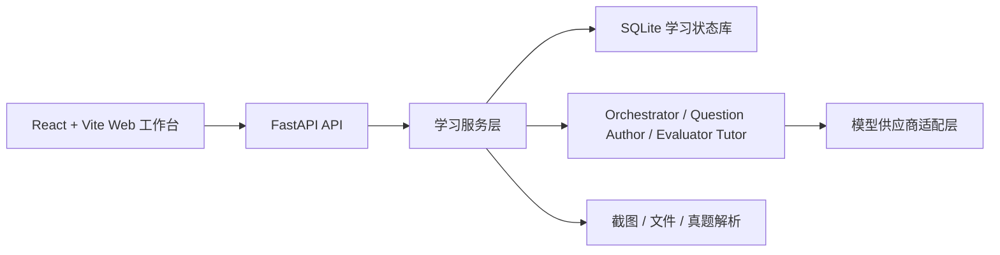

# Lang Drill Agent（语言学习训练 Agent）

Lang Drill Agent 是一个面向语言考试备考的本地 Web（网页）学习工作台。它把“导入词表、生成题组、逐题作答、判题讲解、错题回流和学习统计”串成可追踪流程，重点服务英语四级/六级（CET-4/CET-6，大学英语四级/六级）、法语四级和日语四级/六级备考。

## 解决的问题

传统背词和刷题工具常见问题是：词表、题目、作答记录、错题复习和模型讲解分散在不同地方。这个项目把正式学习状态统一写入 SQLite（轻量数据库），模型只负责生成和讲解，题目落库、判分、进度和统计由程序负责。

## 核心功能

- Web 三栏学习工作台：左侧学习状态，中间聊天与题卡，右侧分支、手机映像和截图导入。
- 正式刷题流程：一次生成完整题组并入库，再逐题展示、判分和自动推进。
- 截图词表导入：支持手机背词截图 OCR（文字识别）、文本/PDF/DOCX（Word 文档格式）导入，并自动生成考试式语境题。
- 模型配置：支持 OpenAI/GPT、Claude、DeepSeek（深度求索）、MiMo（小米米魔）和自定义 OpenAI-compatible（OpenAI 兼容）供应商。
- 学习统计：展示题目完成、词汇掌握、正确率、考试倒计时、token（令牌）用量和上下文容量。
- 当日总结：输入“总结 / 复盘”后，当前模型基于当日题目、作答、错题和聊天记录生成详细复盘。
- 真题参考：按考试维护近三年真题索引和本地导入资产，组卷时参考题型与风格摘要，不发布版权不明完整真题。

## 架构



核心入口：

- 前端：[frontend/src/App.tsx](frontend/src/App.tsx)
- 后端 API：[backend/langdrill_agent/api.py](backend/langdrill_agent/api.py)
- Agent 实现：[backend/langdrill_agent/agents.py](backend/langdrill_agent/agents.py)
- 服务层：[backend/langdrill_agent/services.py](backend/langdrill_agent/services.py)
- 测试：[try/](try/)

## 本地运行

```powershell
py -m venv .venv
.\.venv\Scripts\Activate.ps1
pip install -e .[dev]
cd frontend
npm install
cd ..
.\start.bat
```

访问 `http://127.0.0.1:5173`。停止服务：

```powershell
.\stop.bat
```

真实 API Key（接口密钥）只写入本地 `.env`，不要提交。示例变量见 [.env.example](.env.example)。

## 验证

```powershell
py -m pytest try -q
py -m ruff check backend try
cd frontend
npm run build
```

项目已添加 GitHub Actions CI（持续集成）：推送和 Pull Request（拉取请求）会运行后端测试、Python（编程语言）检查和前端构建。

## 我的职责

- 设计并实现 Web 三栏学习工作台、截图导入、模型配置、权限设置、上下文容量和学习统计体验。
- 搭建 FastAPI（Web API 框架）+ SQLite（轻量数据库）后端状态机，保证题组、作答、掌握度和会话历史可追踪。
- 实现多 Agent（智能体）协作：任务路由、结构化出题、校验、判题讲解和模型供应商适配。
- 建立本地回归测试和 CI（持续集成），覆盖关键学习流程、模型配置、截图导入、数据路径迁移和启动链路。

## 当前完成度

- 已完成：Web 主流程、正式题组入库、答题推进、截图词表导入、模型配置、真题索引、学习统计、上下文压缩入口和本地测试。
- 已验证：后端测试、ruff（Python 代码检查）、前端 build（构建）和全链路 smoke（冒烟）流程。
- 仍需优化：`api.py` 和 `services.py` 文件偏大，后续应拆分 routes（路由）和 core（核心公共模块）；前端 `App.tsx` 也需要逐步组件化。

## 下一步计划

- 拆分 `backend/langdrill_agent/api.py` 为 `routes/chat.py`、`routes/settings.py`、`routes/imports.py`、`routes/papers.py` 和公共 `core` 模块。
- 增加 API endpoint contract（接口契约）测试和更多前端交互验收。
- 补充更多脱敏截图和演示视频。
- 为真实模型输出质量建立对比样例和人工验收记录。

## License（许可证）

本项目为 source-available（源码可见）项目。非商业用途按 PolyForm Noncommercial License 1.0.0（PolyForm 非商业许可证 1.0.0）授权；商业用途需要单独取得书面商业许可。详见 [LICENSE](LICENSE) 和 [COMMERCIAL.md](COMMERCIAL.md)。
