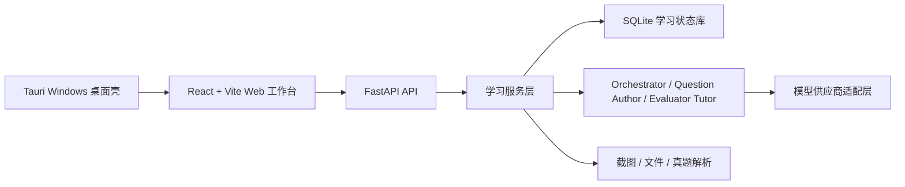

# Lang Drill Agent

Lang Drill Agent 是一个面向语言考试备考的本地学习工作台，核心目标是解决“背单词和刷题分离”的问题。

很多学习工具把词表、练题、错题、讲解和统计拆成几套流程：背完词还要手动找题，做完题又很难回到具体词汇和薄弱点。Lang Drill Agent 把导入词表、生成题组、逐题作答、判题讲解、错题回流和学习统计串成一个闭环，让每个词条都能进入真实练习，让每次作答都能回到后续复习。

项目重点服务英语四级/六级、法语四级、日语四级/六级等语言考试。正式学习状态统一写入 SQLite，模型负责生成题目和讲解，程序负责题目落库、判分、进度推进和统计，避免学习记录散落在聊天上下文里。

当前同时提供 Web 版和 Windows 桌面版。桌面版用 Tauri 承载同一套 React/Vite 界面，并在本机启动 FastAPI 后端；Web 开发启动方式保持不变。

## 核心功能

- 三栏学习工作台：左侧学习状态，中间聊天与题卡，右侧分支、手机映像和截图导入。
- 词表到刷题闭环：导入词表后自动生成考试式题组，逐题展示、判分并推进下一题。
- 截图和文件导入：支持手机背词截图 OCR、TXT、Markdown、PDF、DOCX 和图片文本抽取。
- 考试式题型：优先生成英文语境句、完形空格、阅读语境问题和同义改写，避免退化成单纯选中文释义。
- 个性化讲解：答题后由模型结合当前题目、用户背景、自定义指令和会话上下文生成讲解。
- 学习统计：展示题目完成、词汇掌握、正确率、考试倒计时、token 用量和上下文容量。
- 模型配置：支持 OpenAI/GPT、Claude、DeepSeek、MiMo 和自定义 OpenAI-compatible 供应商。
- 当日复盘：输入“总结”或“复盘”后，模型基于当日题目、作答、错题和聊天记录生成学习复盘。
- 真题参考：按考试维护近三年真题索引和本地导入资产，组卷时参考题型与风格摘要，不发布版权不明的完整真题。

## 架构



核心入口：

- 前端：[frontend/src/App.tsx](frontend/src/App.tsx)
- 后端 API：[backend/langdrill_agent/api.py](backend/langdrill_agent/api.py)
- Agent 实现：[backend/langdrill_agent/agents.py](backend/langdrill_agent/agents.py)
- 服务层：[backend/langdrill_agent/services.py](backend/langdrill_agent/services.py)
- 桌面壳：[src-tauri/](src-tauri/)
- 测试：[try/](try/)

## 本地运行

```powershell
py -m venv .venv
.\.venv\Scripts\Activate.ps1
pip install -e .[dev]
cd frontend
npm install
cd ..
.\start.bat
```

访问：

```text
http://127.0.0.1:5173
```

停止服务：

```powershell
.\stop.bat
```

真实 API Key 只写入本地 `.env`，不要提交。示例变量见 [.env.example](.env.example)。

## 产品展示网站

独立展示站点位于 [演示web](演示web)，不改动主应用 `frontend/`。它用于对外介绍 Lang Drill Agent 的核心闭环，包含默认跟随系统的双主题、动态单词银河、滚动组卷演示、脱敏截图画廊、GitHub/安装包入口和一个可探索的三栏工作台模拟器。

```powershell
cd 演示web
npm install
npm run dev
npm run build
```

该站点是静态前端，适合部署到 GitHub Pages。演示工作台不连接真实后端，不读取 `.env`，模型回复为固定模拟内容。

## Windows 安装包

当前 Windows 安装包发布在 GitHub Release：

- 发布页：[Lang Drill Agent v0.1.0](https://github.com/q2955161835-debug/lang-drill-agent/releases/tag/v0.1.0)
- 安装包下载：[Lang.Drill.Agent_0.1.0_x64-setup.exe](https://github.com/q2955161835-debug/lang-drill-agent/releases/download/v0.1.0/Lang.Drill.Agent_0.1.0_x64-setup.exe)
- SHA256：`db89330034936a89092b2b65a2cd7150de7a8b7adc94da7640962101596db384`

这是未签名的内测安装包。Windows 可能提示未知发布者，确认来源后继续安装即可。

安装后，用户配置、数据库、日志和 `papers` 会写入 `%APPDATA%\Lang Drill Agent`；运行时缓存写入 `%LOCALAPPDATA%\Lang Drill Agent\runtime`。首次启动会优先复用本机已有 Python 3.11+；如果本机没有可用 Python，才会联网下载并准备 Python 3.11.9 和后端依赖。

如果需要自己构建安装包：

```powershell
powershell.exe -NoProfile -ExecutionPolicy Bypass -File scripts\desktop\build-desktop.ps1 -SkipInstall
```

构建产物：

```text
src-tauri\target\release\bundle\nsis\Lang Drill Agent_0.1.0_x64-setup.exe
```

## 验证

```powershell
py -m pytest try -q
py -m ruff check backend try
cd frontend
npm run build
cd ..
cargo check --manifest-path src-tauri\Cargo.toml
```

项目已配置 GitHub Actions CI。推送和 Pull Request 会运行后端测试、Python 代码检查和前端构建。

Windows 安装包在发布前已经通过临时 Windows VM 安装验收：构建安装包、安装到自定义目录、验证桌面快捷方式、启动安装目录内的桌面后端运行时、检查 `/api/health`、卸载并清理临时目录。

## 我的职责

- 设计并实现三栏学习工作台、截图导入、模型配置、权限设置、上下文容量和学习统计体验。
- 搭建 FastAPI + SQLite 后端状态机，保证题组、作答、掌握度和会话历史可追踪。
- 实现多 Agent 协作：任务路由、结构化出题、校验、判题讲解和模型供应商适配。
- 建立本地回归测试和 CI，覆盖关键学习流程、模型配置、截图导入、数据路径迁移和启动链路。
- 构建 Windows 桌面版和 NSIS 安装包，并通过干净 Windows VM 做发布前安装验收。

## 当前完成度

已完成：

- Web 主流程和 Windows 桌面版安装包。
- 正式题组入库、答题推进、判题讲解和错题回流。
- 截图词表导入、文件文本抽取、真题索引和考试式组卷。
- 模型配置、权限设置、学习统计、上下文容量和当日复盘。
- 本地测试、CI 和发布前 Windows VM 安装验收。

仍需优化：

- `api.py` 和 `services.py` 文件偏大，后续应拆分 routes 和 core 模块。
- 前端 `App.tsx` 需要继续组件化。
- 未签名安装包的真实用户首次安装体验仍需持续收集反馈。
- 真实模型输出质量需要更多样例和人工验收记录。

## 下一步计划

- 拆分 `backend/langdrill_agent/api.py` 为聊天、设置、导入、真题和公共核心模块。
- 增加 API endpoint contract 测试和更多前端交互验收。
- 扩展 Windows 桌面版人工验收：配置 API Key、导入截图、刷题、退出重启和异常日志定位。
- 补充更多脱敏截图和演示视频。
- 为真实模型输出质量建立对比样例和人工验收记录。

## License

本项目为 source-available 项目。非商业用途按 PolyForm Noncommercial License 1.0.0 授权；商业用途需要单独取得书面商业许可。详见 [LICENSE](LICENSE) 和 [COMMERCIAL.md](COMMERCIAL.md)。
