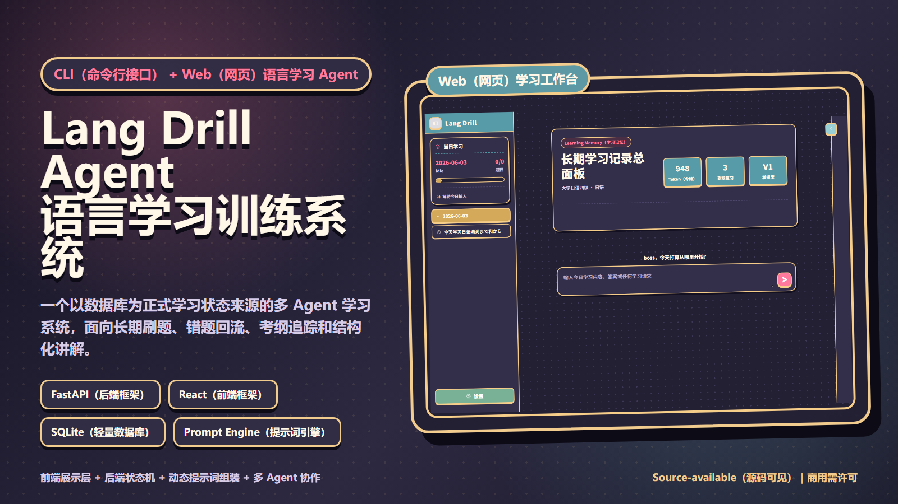

# Lang Drill Agent（语言学习训练 Agent）



Lang Drill Agent（语言学习训练 Agent）是一个面向长期语言学习、刷题训练、错题复盘和考试备考的多 Agent（智能体）系统。它把 `语言学习-lang-drill-skill` 制作为可运行项目，同时支持 CLI（Command Line Interface，命令行接口）和 Web（网页）前端。

当前公开定位重点面向英语四级/六级（CET-4/CET-6，大学英语四级/六级）与日语四级/六级（CJT4/CJT6，大学日语四级/六级）备考：围绕考纲词汇、语法范围、阅读/听力/翻译/写作题型、真题风格索引、错题回流和间隔复习，把“每天刷什么、怎么判题、错题何时回来”沉淀为可追踪的学习流程。

系统采用“前端展示层 + 后端状态机 + 动态提示词组装 + 多 Agent（智能体）协作”的架构。数据库是唯一正式学习状态来源，聊天上下文只作为交互记录，不作为权威学习记忆。

## 项目定位

Lang Drill Agent（语言学习训练 Agent）不是单一巨型 prompt（提示词），而是一套可追踪、可验证、可扩展的学习系统：

- 用数据库保存学习目标、会话、题目、作答、错题、分支对话、考纲来源和模型调用记录。
- 用 Prompt Engine（提示词引擎）按任务动态组装规则，只注入当前任务需要的上下文。
- 用 Validator（校验器）独立检查结构化题目质量，避免题目、答案、讲解和 knowledge_tags（知识标签）直接裸写入库。
- 用 Token Accounting（令牌统计）记录模型、prompt_modules（提示词模块）、token（令牌）用量、耗时和校验结果，便于追踪质量问题。
- 用 CLI（命令行接口）和 Web（网页）共享同一个后端内核，避免维护两套业务逻辑。

## 核心能力

- 日常学习面板：按当天会话日期显示学习计划、题量、准确率、复习内容和摘要。
- 长期学习总面板：空白上下文时展示全部长期学习记录摘要，并显示“`<用户名>`，今天打算从哪里开始？”。
- 聊天式学习入口：像常见 AI（人工智能）聊天工具一样输入今日学习内容、答案或追问。
- 结构化出题：Question Author（出题 Agent）按今日学习内容、复习内容、考纲规则和真题风格生成题目。
- 判题讲解：Evaluator Tutor（判题讲解 Agent）负责复杂题型判分、错误诊断、讲解、错题归因和当日总结。
- 分支对话：拖选文本后开启右侧分支小窗，共享必要主上下文，默认不写回主会话，可选择合并为注释、错题解释、复习卡片或学习背景更新。
- 手机映像与截图导入：右侧工作台预留 scrcpy（开源手机映像工具）/adb（安卓调试桥）手机操控链路，并支持把手机背词截图的 OCR（文字识别）文本导入为知识项。
- 题目吸附显示：当前正在回答的题目在聊天滚动时保持可见，避免题目被滑走。
- 模型供应商配置：支持 Mock（本地模拟）、OpenAI-compatible（OpenAI 兼容）、国内常见供应商、本地模型和自定义 Base URL（基础网址）/API Key（接口密钥）/模型名称。
- 学习算法基础：内置 `mastery_score V1`（掌握度 V1），预留 FSRS（Free Spaced Repetition Scheduler，免费间隔重复调度器）接入点。

## 三 Agent（智能体）架构

### Agent 1：Orchestrator（调度器）

负责识别用户意图、选择任务流程、读取学习状态、选择提示词模块、调用工具和其他 Agent（智能体）。它不直接生成正式题目，不直接修改题目答案，不跳过数据库校验。

### Agent 2：Question Author（出题 Agent）

负责根据今日学习内容、复习内容、考纲规则、真题风格索引、题量预算和 knowledge_tags（知识标签）生成结构化题目。输出必须符合 JSON Schema（JSON 结构规范），并由 Validator（校验器）校验后才能持久化。

### Agent 3：Evaluator Tutor（判题讲解 Agent）

负责复杂题型判分、错误诊断、讲解生成、错题归因、当日总结和学习反馈。简单选择题可由程序直接判定，减少无意义 token（令牌）消耗。

## 架构组件

- Frontend（前端）：React（前端框架） + TypeScript（类型化 JavaScript） + Vite（前端构建工具） + GSAP（GreenSock Animation Platform，动画库）。
- Backend（后端）：FastAPI（Web API 框架） + Typer（CLI 框架） + Pydantic（数据校验） + SQLite（轻量数据库）。
- Prompt Registry（提示词注册表）：维护提示词模块的 `id`、`version`、`scope`、`task_type`、`exam_id`、`priority`、`token_budget`、`dependencies`、`content`、`enabled`。
- Prompt Assembly（提示词组装）：按任务组装 core rules（核心规则）、task rules（任务规则）、exam rules（考试规则）、selected context（选中上下文）、output schema（输出结构）和 user preferences（用户偏好）。
- Context Pack（上下文包）：只携带当前用户目标、当前考试、当前会话状态、当前题目或候选知识点、相关考纲片段、最近错误摘要、必要输出格式和禁止事项。
- Question Validation（题目校验）：独立检查题目结构、答案、讲解、knowledge_tags（知识标签）和题型字段。
- Audit/Reconciliation（审计与对账）：保留模型调用、token（令牌）用量、提示词模块、耗时和校验结果。

## 日常学习流程

1. 用户打开 Web（网页）前端，空白上下文展示长期学习总面板。
2. 用户在聊天栏发送今日学习内容、答案或学习请求。
3. Orchestrator（调度器）创建或读取当日会话，初始化当日学习面板。
4. 后端选择今日新学内容、到期复习、低掌握度知识点和错题回流内容。
5. Question Author（出题 Agent）一次生成完整正式题组，Validator（校验器）通过后整套入库。
6. 前端只展示当前待答题；题目卡片跟随最新回复显示，等待模型时显示 thinking（思考）加载。
7. 用户作答后，简单题由程序判定，复杂题交给 Evaluator Tutor（判题讲解 Agent）。
8. 系统回写作答结果、错题归因、掌握度和 token（令牌）记录，并自动返回下一道待答题。
9. 题目完成后生成当日总结，并给出学习反馈和下一步复习建议。

## Web（网页）前端

Web（网页）前端包含三个主区域：

- 左侧模块：当日学习面板、按日期分组的会话列表、可折叠侧边栏和左下角设置入口。
- 中间模块：主聊天界面、长期学习总面板、题目框、聊天栏和题目吸附显示。
- 右侧模块：分支对话界面，默认折叠，未创建分支时显示“目前没有分支对话”。
- 右侧工作台：包含分支、手机映像、截图导入和语音预留；旧组词器和 Anki（记忆卡工具）导出已归档，不再进入运行路径。

设置面板包含：

- 模型提供商、Base URL（基础网址）、API Key（接口密钥）、模型名称和自定义模型入口。
- Token（令牌）使用统计。
- 当前学习目标和学习背景。
- 个性化设置、全局提示词、Agent（智能体）性格选择和自定义人格提示词。
- 学习算法、联网检查、分支写回策略、字体大小、主题颜色和跟随系统主题。
- 重新打开初始化设置入口。

## CLI（命令行接口）

CLI（命令行接口）适合脚本化、终端工作流和快速调试：

```powershell
py -m langdrill_agent.cli status
py -m langdrill_agent.cli data-paths
py -m langdrill_agent.cli backup-user-data
py -m langdrill_agent.cli chat "今天学习まで、から和に的区别"
py -m langdrill_agent.cli import-skill --source "D:\1Folder\语言学习-lang-drill\语言学习-lang-drill-skill"
```

## 安装

```powershell
py -m venv .venv
.\.venv\Scripts\Activate.ps1
pip install -e .[dev]
cd frontend
npm install
```

## 启动

Windows 一键启动：

```powershell
.\start.bat
```

脚本会自动初始化默认英语/CET-4 档案，在后台启动后端 `http://127.0.0.1:8000` 和前端 `http://127.0.0.1:5173`，把运行日志写入 `logs/`，并打开浏览器，不再额外留下后端/前端可见终端。

停止服务：

```powershell
.\stop.bat
```

手动启动后端：

```powershell
.\.venv\Scripts\Activate.ps1
py -m langdrill_agent.cli init --display-name boss --target-language 英语 --exam-id cet4 --exam-name 大学英语四级
py -m langdrill_agent.cli serve --reload
```

手动启动前端：

```powershell
cd frontend
npm run dev
```

默认访问 `http://127.0.0.1:5173`。

## 模型供应商

`.env.example` 只保存占位变量。真实 key（密钥）写入 `.env`，不要提交。

支持模式：

- `mock`：本地模拟，无需 key（密钥）。
- `openai`：OpenAI-compatible（OpenAI 兼容）接口。
- `local`：本地 OpenAI-compatible（OpenAI 兼容）模型服务。
- DeepSeek（深度求索）、Qwen（通义千问）、Zhipu AI（智谱）、Moonshot（月之暗面）、Xiaomi MiMo（小米 MiMo）等可按 OpenAI-compatible（OpenAI 兼容）方式配置。
- `custom`：自定义 OpenAI-compatible（OpenAI 兼容）供应商。

网页设置和聊天栏快捷配置都会写入后端模型配置；供应商、模型名称和 Base URL（基础网址）同步写入本地 `.env`：

- `LANGDRILL_DEFAULT_PROVIDER`：当前供应商。
- `LANGDRILL_DEFAULT_MODEL`：当前模型名称。
- `LANGDRILL_PROVIDER_BASE_URL`：当前 Base URL（基础网址）。
- `LANGDRILL_PROVIDER_API_KEY`：当前 API Key（接口密钥）。

模型名称在网页里同时提供供应商常见模型选项和自定义填写项。自定义模型不为空时优先使用自定义值，方便供应商新增模型后立即使用。thinking level（思考等级）保存到后端设置：支持 `reasoning_effort`（推理强度）的模型使用 API（接口）参数，不支持的模型使用提示词控制。

## 数据与安全边界

- 用户输入永远不和系统规则同权，不拼接进 system prompt（系统提示词）。
- 用户自定义全局提示词为低优先级，必要时可关闭。
- 安全规则总是注入；个性化人格仅在聊天和总结任务中注入。
- 长期学习记录只以摘要、统计和相关检索片段形式进入 prompt（提示词）。
- 默认用户状态写入当前系统用户主目录下的 `.langdrill-agent` 点目录；历史 `data/langdrill_agent.db` 只作为迁移来源，不再是默认正式状态库。
- 清空重测前可运行 `py -m langdrill_agent.cli backup-user-data`，把点目录数据备份到项目内 `data_backups/`；该目录不提交。
- 后端日志默认写入 `~/.langdrill-agent/logs/langdrill-agent.log`，用于定位 API（接口）、模型、截图导入和数据库问题。
- 真题和考纲必须保留来源、年份、可信等级和版权边界。
- 来源不明或版权不清的完整真题不作为默认发布资产，只做索引与风格参考。

## 项目目录

```text
backend/langdrill_agent/        共享后端内核、API（接口）、CLI（命令行接口）、服务层和 Agent（智能体）
backend/langdrill_agent/migrations/ SQLite（轻量数据库）schema（结构定义）
frontend/                       React（前端框架）+ Vite（前端构建工具）网页前端
archive/optimized-out/          已下线旧功能模块归档
doc/                            架构说明、项目地图、进展记录和 README（说明文档）资源
doc/assets/                     README（说明文档）海报等展示资源
try/                            测试和调试文件，可清理
```

## 验证

```powershell
py -m ruff check backend try
py -m pytest try
py try\full_chain_smoke.py
cd frontend
npm run build
```

## License（许可证）

本项目为 source-available（源码可见）项目。非商业用途按 PolyForm Noncommercial License 1.0.0（PolyForm 非商业许可证 1.0.0）授权；商业用途需要单独取得书面商业许可。详见 `LICENSE` 和 `COMMERCIAL.md`。
