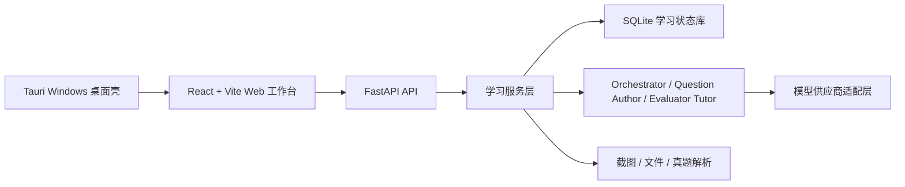

# Lang Drill Agent

> 语言：[简体中文](README.md) | [English](README.en.md) | [日本語](README.ja.md)

Lang Drill Agent 是一个面向语言考试备考的本地学习工作台，核心目标是解决“背单词和刷题分离”的问题。

很多学习工具把词表、练题、错题、讲解和统计拆成几套流程：背完词还要手动找题，做完题又很难回到具体词汇和薄弱点。Lang Drill Agent 把导入词表、生成题组、逐题作答、判题讲解、错题回流和学习统计串成一个闭环，让每个词条都能进入真实练习，让每次作答都能回到后续复习。

项目重点服务英语四级/六级、法语四级、日语四级/六级等语言考试。正式学习状态统一写入 SQLite，模型负责生成题目和讲解，程序负责题目落库、判分、进度推进和统计，避免学习记录散落在聊天上下文里。

当前同时提供 Web 版和 Windows 桌面版。桌面版用 Tauri 承载同一套 React/Vite 界面，并在本机启动 FastAPI 后端；Web 开发启动方式保持不变。当前版本为 `v1.0.2` 实验版，`v1.0.1` 作为上一个实验版保留，正式学习流程保持不变。

## 核心功能

- 三栏学习工作台：左侧学习状态，中间聊天与题卡，右侧分支、手机映像和截图导入。
- 词表到刷题闭环：导入词表后自动生成考试式题组，逐题展示、判分并推进下一题。
- 截图和文件导入：支持手机背词截图 OCR、TXT、Markdown、PDF、DOCX 和图片文本抽取。
- 考试式题型：优先生成英文语境句、完形空格、阅读语境问题和同义改写，避免退化成单纯选中文释义。
- 个性化讲解：答题后由模型结合当前题目、用户背景、自定义指令和会话上下文生成讲解。
- 学习统计：展示题目完成、词汇掌握、正确率、考试倒计时、token 用量和上下文容量。
- 模型配置：支持 OpenAI/GPT、Claude、DeepSeek、MiMo 和自定义 OpenAI-compatible 供应商。
- 当日复盘：输入“总结”或“复盘”后，模型基于当日题目、作答、错题和聊天记录生成学习复盘。
- 真题参考：按考试维护近三年真题索引和本地导入资产，组卷时参考题型与风格摘要，不发布版权不明的完整真题。

## 创造模式（可选 · 实验性）

创造模式是可选的实验性 Agent 能力，默认关闭，不影响正常刷题与学习流程。开启后可调用本地 Pi 运行时执行目录整理、文件操作等通用任务，并提供逐次审批、智能审批和完全访问三档权限。

> ⚠️ 警告：创造模式的通用权限可以修改本机文件。请仅在理解风险后启用，并优先使用逐次审批档位。创造模式仍为实验性，模型不可用时回退本地规则兜底，不阻断正式学习。

## 知识库与记忆

- 知识库（RAG）：支持拖拽或选择 PDF、DOCX、TXT、Markdown 和截图。文件先进入待解析队列，用户可检查文本预览、诊断和元数据，再确认写入知识库；答题讲解和分支对话可引用带来源标注的检索结果。
- 真题库：本地文件和截图使用同一套“暂存 → 解析预览 → 编辑元数据 → 确认入库”流程。没有可靠答案的内容只作为题型与风格证据，不会伪装成已验证答案。
- 嵌入模型与向量增强检索：RAG 可主动关闭或开启；关闭、模型未就绪或索引异常时自动使用 SQLite FTS5。用户可选择推荐的 `Qwen/Qwen3-Embedding-0.6B`，搜索并确认下载 Hugging Face 上兼容的任意嵌入模型，也可配置 Hugging Face 云端或 OpenAI-compatible 云端嵌入服务。
- 分层记忆：设置页只暴露“关于我 / 学习记录 / 使用习惯”三个易懂分组，并提供节省（5,000 token）、标准（10,000 token）和深入（动态使用最多 70% 可用上下文）三档预算。记忆保存在本地数据库，支持查看来源证据、修订历史、归档、恢复和分组清理。

## 真题版权边界

真题资产仅作为本地参考：默认只保留考试索引和短摘录，完整真题文件保存在用户本地 `papers/<考试>/raw` 目录，不进入默认发布资产。出题 Agent 参考真题题型与风格，不复刻或长段引用完整真题原文。请用户自行确保导入的真题内容符合版权与使用许可。

## 架构



核心入口：

- 前端：[frontend/src/App.tsx](frontend/src/App.tsx)
- 后端 API：[backend/langdrill_agent/api.py](backend/langdrill_agent/api.py)
- Agent 实现：[backend/langdrill_agent/agents.py](backend/langdrill_agent/agents.py)
- 服务层：[backend/langdrill_agent/services.py](backend/langdrill_agent/services.py)
- 桌面壳：[src-tauri/](src-tauri/)
- 测试：[try/](try/)

## 安装与本地运行

Web 开发模式：

```powershell
py -m venv .venv
.\.venv\Scripts\Activate.ps1
pip install -e ".[dev,paper-parsing]"
cd frontend
npm install
cd ..
.\start.bat
```

如需在本机运行下载后的 Hugging Face 嵌入模型，再安装可选运行时：

```powershell
pip install -e ".[embeddings-local]"
```

访问：

```text
http://127.0.0.1:5173
```

停止服务：

```powershell
.\stop.bat
```

真实 API Key 只写入本地 `.env`，不要提交。示例变量见 [.env.example](.env.example)。

## Web 与桌面版使用

Web 版面向开发与日常使用，桌面版面向 Windows 用户。桌面版安装后自动启动本地后端，用户配置、数据库、日志和 `papers` 写入 `%APPDATA%\Lang Drill Agent`，不污染 Web 开发环境。两种模式共享同一前端和后端业务能力。

界面支持简体中文、English、日本語三种语言，可在设置 → 语言页切换；界面语言只影响应用壳文案，不影响模型回复、题目和自定义指令的语言。

## 产品展示网站

独立展示站点当前以 [演示web2](演示web2) 为 GitHub Pages 发布源，不改动主应用 `frontend/`。它用于对外介绍 Lang Drill Agent 的核心闭环，包含默认跟随系统的双主题、动态单词银河、滚动组卷演示、脱敏截图画廊、GitHub/安装包入口和一个可探索的三栏工作台模拟器。

```powershell
cd 演示web2
npm install
npm run dev
npm run build
```

该站点是静态前端，由 `.github/workflows/pages-demo-web2.yml` 构建并部署到 GitHub Pages：`https://q2955161835-debug.github.io/lang-drill-agent/`。下载区只展示稳定版 `v0.1.2` 与当前实验版 `v1.0.2`，右上角和首页默认下载稳定版；在线体验入口仍保持实验版。历史版本继续保留在 GitHub Release，但不出现在演示网页。演示工作台不连接真实后端，不读取 `.env`，模型回复为固定模拟内容。

## Windows 安装包与更新

当前 Windows 安装包发布在 GitHub Release：

- 稳定版 `v0.1.2`：[发布页](https://github.com/q2955161835-debug/lang-drill-agent/releases/tag/v0.1.2) · [安装包](https://github.com/q2955161835-debug/lang-drill-agent/releases/download/v0.1.2/Lang.Drill.Agent_0.1.2_x64-setup.exe)
- 当前实验版 `v1.0.2`：[发布页](https://github.com/q2955161835-debug/lang-drill-agent/releases/tag/v1.0.2) · [安装包](https://github.com/q2955161835-debug/lang-drill-agent/releases/download/v1.0.2/Lang.Drill.Agent_1.0.2_x64-setup.exe)
- 上一个实验版 `v1.0.1`：[发布页](https://github.com/q2955161835-debug/lang-drill-agent/releases/tag/v1.0.1) · [安装包](https://github.com/q2955161835-debug/lang-drill-agent/releases/download/v1.0.1/Lang.Drill.Agent_1.0.1_x64-setup.exe)
- 各版本 SHA256 校验值见对应 Release 附件中的 `checksums.sha256`。

这是未签名的内测安装包。Windows 可能提示未知发布者，确认来源后继续安装即可。

安装目录必须使用英文/ASCII 路径，例如 `C:\LangDrillAgent` 或 `D:\LangDrillAgent`；如果选择中文或其它非 ASCII 路径，安装器会中止并提示更换目录。

桌面版计划接入 Tauri 官方 updater 插件，通过签名 `latest.json` 清单检查和安装更新；签名私钥只存 GitHub Actions Secrets。更新检查与安装均由用户主动触发，失败可重试并查看日志。

如果需要自己构建安装包：

```powershell
powershell.exe -NoProfile -ExecutionPolicy Bypass -File scripts\desktop\build-desktop.ps1 -SkipInstall
```

## 验证

```powershell
py -m pytest tests -q
py -m ruff check backend tests scripts
cd frontend
npm run build
npm run test -- --run
cd ..
npm --prefix runtime/pi-bridge test
cargo check --manifest-path src-tauri\Cargo.toml
```

项目已配置 GitHub Actions CI。推送和 Pull Request 会运行 Python 代码检查、后端测试、前端构建、前端 Vitest 测试、Pi 桥接测试和桌面壳 `cargo check`。桌面安装包可通过 `Desktop Installer VM Test` 手动触发 Windows VM 验收。

## 实验版状态

当前版本 `v1.0.2` 为实验性预发布：创造模式、签名更新中心、三语界面和演示站同步均为实验性能力，可能存在不稳定。正式学习流程（词表导入、组卷、答题、讲解、复盘）保持稳定。升级前请备份 `%APPDATA%\Lang Drill Agent` 数据目录，如需回退可重新安装上一个实验版 `v1.0.1` 或 `v0.1.2` 稳定版。

## License

本项目为 source-available 项目。非商业用途按 PolyForm Noncommercial License 1.0.0 授权；商业用途需要单独取得书面商业许可。详见 [LICENSE](LICENSE) 和 [COMMERCIAL.md](COMMERCIAL.md)。
