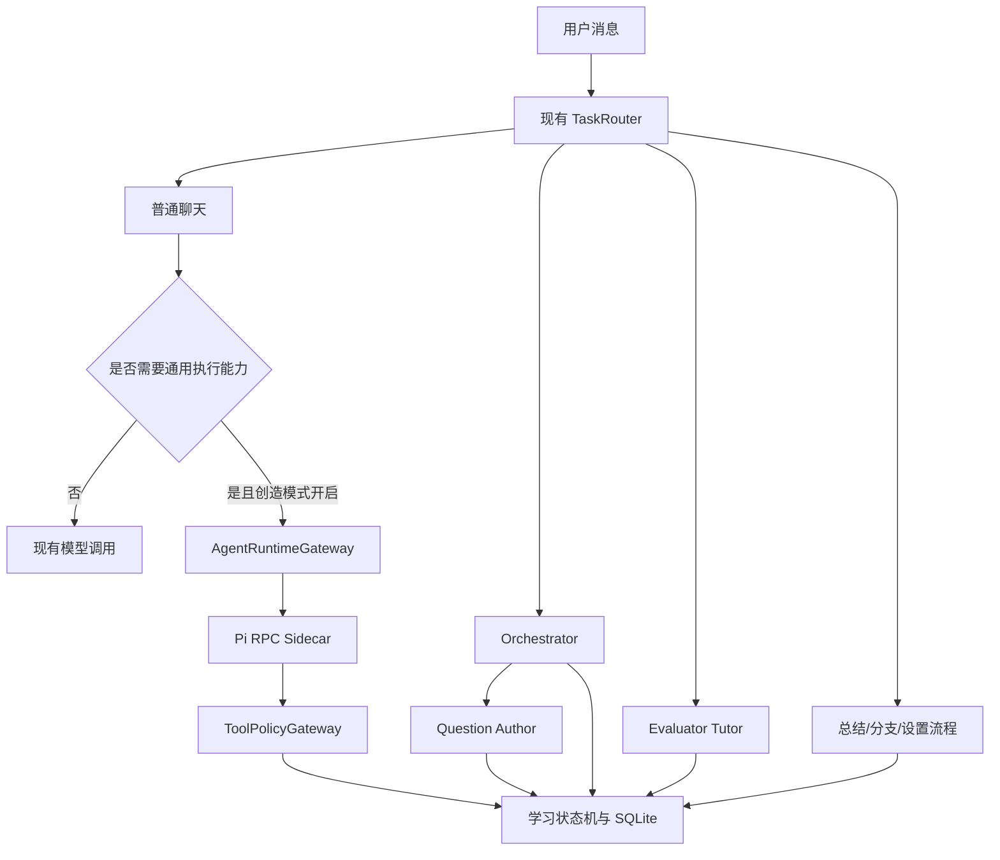

# Lang Drill Agent 能力扩展设计规格

状态：用户已确认；实施暂停，等待恢复指令
日期：2026-07-22
适用仓库：`lang-drill-agent`
目标版本：分阶段交付，最终实验版 `v1.0.0-experimental.1`

## 1. 背景与结论

Lang Drill Agent 当前已经具备可靠的语言学习领域闭环：程序负责题组、作答、掌握度、会话和 SQLite 正式状态，模型负责规划辅助、出题与个性化讲解。但现有通用 Agent 能力、用户文档知识库、复杂任务闭环、长期记忆、可执行 Skill、真题检索与桌面更新仍不完整。

本设计采用“保留学习核心 + 增加公共智能能力 + 可选 Pi 通用运行时”的架构，不让 Pi 替换现有前台 Agent，也不改变普通用户的主要学习流程。

核心结论：

1. 当前 `TaskRouter`、Orchestrator、Question Author、Evaluator Tutor 和学习状态机继续存在。
2. RAG、记忆、任务 Trace、可靠性和真题检索属于所有模式的公共能力。
3. 创造模式是全局能力覆盖层，不是新的聊天人格或独立会话类型。
4. 创造模式开启后，所有会话均可在需要时使用 Pi 的文件、命令、网络、Skill 和扩展能力。
5. SQLite 继续作为会话、学习状态、任务、工具审计和记忆的唯一正式事实源；Pi 会话不得成为第二套事实源。
6. 用户明确内容和刚导入资料始终高于真题热度；真题主要决定“怎么考”，不能擅自替换“练什么”。
7. 真实真题必须先获取并解析成功才计入真题库，禁止用近三年占位索引冒充已内置试卷。

## 2. 目标与非目标

### 2.1 目标

- 补齐统一任务运行时、流式事件、取消、重试、恢复、Trace 和工具审计。
- 建立用户学习文档知识库与混合 RAG。
- 建立证据驱动、可配置、可关闭的分层长期记忆。
- 为复杂任务增加计划、执行、验证、重规划和重启恢复闭环。
- 将真题系统升级为自动导入、标准 Markdown 解析、题目级检索和证据蒸馏。
- 增加全局创造模式、Codex 式权限档位和 Pi RPC 运行时。
- 允许 Agent 以 Skill、Pi Extension、Lang Drill 插件或源码修改的方式扩展自身能力。
- 对复杂编程任务自动绑定 Superpowers 工作流，降低用户编程提示词门槛。
- 增加简体中文、英文、日文 UI，以及三语 README。
- 增加签名的应用检查更新和更新安装能力。

### 2.2 非目标

- 不使用 Pi 替代现有学习状态机、判分、掌握度和题目入库逻辑。
- 不让 UI 语言自动改变模型回复、题目或讲解语言。
- 不把完整试卷内容提交到公开仓库或安装包，除非已确认再分发授权。
- 不把单次错误直接固化为长期弱项。
- 不让记忆或蒸馏结论覆盖数据库中的正式事实。
- 不在浏览器 Web 模式中直接覆盖桌面程序或执行源码 `git pull`。
- 本阶段不新增听力或语音题能力；现有听力禁用边界继续有效。

## 3. 架构原则

### 3.1 前台学习流程不变



创造模式不开启时，普通学习和聊天路径继续工作；开启后也只有需要采取行动的请求才进入 Pi 工具循环。当前题组不会因一次通用任务而丢失或被 Pi 接管。

### 3.2 公共能力与可选运行时分层

```text
Application / Learning Core
├── TaskRouter
├── Orchestrator
├── Question Author
├── Evaluator Tutor
├── Learning State Machine
└── SQLite

Shared Intelligence Services
├── KnowledgeBaseService
├── RetrievalService
├── MemoryService
├── AdaptivePracticeScheduler
├── PastPaperIngestionService
├── PastPaperDistillationService
├── AgentRunService
└── Trace/Audit/Job Services

Optional Creative Runtime
├── AgentRuntimeGateway
├── PiRuntimeAdapter
├── ToolPolicyGateway
├── Skill/Extension Runtime
└── Superpowers Workflow Resolver
```

## 4. 第一阶段：运行时基础与可靠性

在新增大能力前先补齐公共基础，避免把功能继续堆入 `api.py`、`services.py` 和 `App.tsx`。

### 4.1 模块拆分

- 新增独立 API Router：知识库、记忆、Agent Run、创造模式、真题库、更新中心。
- 新增独立 Service：检索、记忆、任务、Pi 运行时、权限、真题导入与蒸馏。
- 前端按 `features/settings`、`features/knowledge`、`features/memory`、`features/agent-runs`、`features/creative-mode` 拆分。
- 保留既有 API 语义，新增接口不迫使现有 CLI 或 Web 调用立即迁移。

### 4.2 公共运行能力

- 统一 `trace_id`、`run_id`、`step_id` 和 `tool_call_id`。
- 为长任务提供流式事件、进度、取消、暂停、继续和超时。
- 模型与网络调用提供可配置重试、指数退避、限流识别和显式 fallback。
- 后台任务持久化，应用重启后从最后完成步骤恢复。
- 数据库写操作使用幂等键，避免重试重复导入、重复出题或重复记忆。
- 前端错误以稳定 `code + params` 渲染，不再解析中文字符串判断失败类型。

## 5. 用户文档知识库与 RAG

### 5.1 数据流

```text
用户明确加入知识库
→ 复用 MinerU / OCR / DOCX / PDF / 文本抽取
→ 内容规范化
→ 按标题、段落、页码和语义边界切块
→ SQLite 文档与块记录
→ FTS5 关键词索引
→ 可选多语言 Embedding
→ 混合检索、去重、融合和重排
→ 在 Token 预算内注入相关证据
```

普通聊天附件只用于本轮，除非用户明确选择“加入知识库”。知识库文件随用户数据目录迁移。

### 5.2 存储

建议新增：

- `knowledge_documents`
- `knowledge_chunks`
- `knowledge_chunk_fts`
- `knowledge_embeddings`
- `retrieval_events`

原始文件放入 `knowledge/raw/`，规范化解析结果放入 `knowledge/parsed/`。每个块保存文档 ID、页码/标题、字符范围、内容哈希、语言、来源和解析器版本。

### 5.3 检索

- FTS5 始终可用，中文和日文使用适配的字符/三元组检索策略。
- 多语言向量检索可选；Embedding 缺失时显式降级到 FTS，而不是让知识库不可用。
- 修改 Embedding、切块或 Tokenizer 配置时标记索引不兼容，由用户确认重建。
- 混合检索结合关键词、语义、元数据过滤、时间、来源可信度和可选 reranker。
- 注入模型的每条证据均携带文档、页码/章节和内容哈希。
- 文档内容视为不可信数据，不得将文档中的提示词当成系统命令。

### 5.4 使用范围

知识库供普通聊天、Question Author、Evaluator Tutor、总结、计划、记忆证据和创造模式工具共同使用。创造模式额外暴露 `knowledge_search`、`knowledge_open`、`knowledge_import` 和 `knowledge_reindex`。

## 6. 真实真题自动导入、Markdown 解析与检索

### 6.1 产品语义

设置页“真题索引”改名为“真题库”。远程来源目录与本地真实试卷分开：

- 远程来源目录表示“发现了可获取试卷”。
- 本地真题库只统计已经下载/导入且成功解析的真实资产。
- 不再自动生成虚假的 2025/2024/2023 真题记录。

### 6.2 自动导入

```text
选择考试
→ Source Adapter 发现公开可访问试卷和答案
→ 建立远程目录项
→ 后台下载原始资产
→ 校验域名、重定向、MIME、大小和哈希
→ 保存 raw
→ MinerU/本地解析
→ 生成 parsed Markdown
→ 派生 structured JSON/SQLite 题目记录
→ FTS/向量索引
→ 质量验证
→ 触发增量蒸馏
```

Source Adapter 只能访问设置中允许的可信域名，不绕过登录、付费、验证码、反爬或访问权限。默认自动同步当前考试最近可用试卷，实际存在的月份、套卷和答案文件使用独立 ID。

用户仍可拖入 PDF、DOCX、图片、TXT、Markdown，粘贴文本或添加公开网址补充真题。

### 6.3 资产结构

```text
papers/<考试>/
├── raw/
├── parsed/
├── structured/
└── distillations/
```

`parsed/<paper_id>.md` 是人类可读、可修改、可重新导入的标准资产，包含 Front Matter：考试、年份、场次、套卷、来源、哈希、解析器和状态。正文按 Section、Passage、Question、Options、Answer、Explanation 和 Source Page 组织。

结构化 JSON 和 SQLite 是从 Markdown 派生的查询层；原始文件和解析 Markdown 保留完整来源链。

### 6.4 题目级数据与检索

在通用知识库基础上增加真题领域表：

- `past_paper_sources`
- `past_paper_import_jobs`
- `past_paper_documents`
- `past_paper_sections`
- `past_paper_passages`
- `past_paper_questions`
- `past_paper_question_fts`
- `past_paper_embeddings`
- `past_paper_retrieval_events`

支持按考试、年份、场次、套卷、题型、知识点、难度、答案可信度和人工核验状态过滤，并支持相似题检索。

### 6.5 旧占位迁移

- 识别 `source_manifest_only` 和 `default_recent_source_manifest`。
- 把占位来源迁入远程目录，不再计入 `exam_assets` 真实数量。
- 只有内容与生成模板完全一致的占位文件才自动移除。
- 用户修改过、替换过或已真实解析的记录全部保留。
- 迁移前备份运行数据库，并记录迁移报告。

## 7. 真题蒸馏与自适应练习调度

### 7.1 蒸馏与调度分离

`PastPaperDistillationService` 只描述考试证据，不直接决定下一轮题量：

- 题型频率与官方结构
- 高频、中频、低频和新出现模式
- 知识点、难度、主题和干扰项模式
- 样本覆盖不足和统计偏差
- 证据数量、来源、年份、置信度和模型/算法版本

内置 `past-paper-distillation` Skill 负责工作流调度，后端服务负责读取、统计、验证和保存事实。

### 7.2 自适应调度

新增 `AdaptivePracticeScheduler`：

```text
score =
  用户明确指定
  当前导入内容
  掌握度缺口
  到期复习
  历史错误模式
  官方考试结构
  真题频率
  未测试不确定性
  冷门覆盖欠账
  探索奖励
- 最近重复
- 单题型饱和
```

选择过程采用约束优化而非简单最高分排序：先满足用户当前目标，再分配个性化复习、冷门覆盖、难度梯度和多样性。

### 7.3 内容优先级

```text
用户本轮明确内容
> 刚导入的单词和学习资料
> 到期复习和个人薄弱项
> 历史错题
> 真题蒸馏高频考点
> 考纲与模型通用知识
```

Question Author 的上下文拆为：

- `primary_learning_targets`：必须考查的内容。
- `exam_style_evidence`：真实题型、语境和难度证据。
- `distilled_exam_patterns`：带证据的命题规律。

后两项不得替换第一项。

### 7.4 动态配额与长尾保底

默认范围：

| 来源 | 动态占比 |
| --- | ---: |
| 用户明确内容和当前导入资料 | 40%–70% |
| 到期复习、低掌握度和错题 | 15%–35% |
| 高频及代表性真题模式 | 10%–25% |
| 冷门、未覆盖和诊断性内容 | 10%–20% |

配额归一化为 100%。用户资料不足时可以重分配，但冷门覆盖不得自然降为零。

- 仅对用户已启用且系统实际支持的题型计算。
- 默认最近 3 个题组或最近 20 题内，每个启用题型至少覆盖一次。
- 冷门内容默认至少占滚动题量 10%。
- 单一热门题型默认不超过 35%，除非用户明确要求专项训练。
- 未覆盖题型累计 `coverage_debt`，欠账越高优先级越高。
- 当前禁用的听力题不参与保底。

知识状态增加 `unknown → diagnostic → learning → reviewing → stable`，未测试不能视为已掌握。

### 7.5 蒸馏设置

- 自动蒸馏开关与频率
- 最小试卷/题目证据数
- 仅使用已验证答案
- 用户导入内容最低占比
- 冷门题最低覆盖
- 单题型最高占比
- 滚动覆盖窗口
- 个性化强度
- 新知识探索开关
- 复习/新内容比例
- 考前强化模式

蒸馏结果和个人覆盖状态建议新增 `past_paper_distillations`、`past_paper_distillation_evidence`、`practice_coverage_ledger` 和 `practice_schedule_events`。每次调度保存候选、约束、最终配额和每道题的选择原因，便于验证热门题是否挤占长尾内容。

## 8. 分层长期记忆

### 8.1 借鉴来源

- Hermes：容量受控的核心记忆、用户画像分离、写入审批和 FTS5 会话检索。
- OpenClaw：长期/每日记录分层、透明文件、混合检索和压缩前刷新。
- Mem0 Memory Triage：未来价值、新颖性、事实性和安全性四道写入门。
- Letta：小型常驻 Core Memory 与按需 Recall/Archival Memory 分离。
- Graphiti：来源、有效时间、冲突替代和历史保留。
- Honcho：Provider、召回模式、观察范围和频率配置。

默认实现为本地 SQLite，不强制依赖外部服务。

### 8.2 分层

```text
Current Context
Core Memory
├── 明确偏好
├── 长期目标
├── 重要约束
└── 已验证教学方式

Retrievable Memory
├── Semantic：稳定事实和长期弱项
├── Episodic：阶段表现和任务经历
├── Procedural：验证有效的流程
└── Temporal：带有效期的计划和状态

Evidence
├── 用户消息
├── 作答/掌握度事件
├── Agent Run 结果
└── 文档/会话来源
```

现有 profile、attempts、mastery、questions 和统计继续是正式事实。记忆只能保存派生结论和召回提示。

### 8.3 写入闭环

```text
提取候选
→ FUTURE UTILITY
→ NOVELTY
→ FACTUALITY
→ SECRET/PRIVACY SCAN
→ ADD / UPDATE / SUPERSEDE / DELETE / NOOP
→ 自动保存或等待审核
→ 建立索引和版本记录
```

- “记住……”形成高置信候选。
- 学习弱项默认需要多次独立作答证据，阈值可调。
- 冲突时旧记忆失效但不删除历史。
- 程序记忆必须来源于已验证成功的任务。
- API Key、token、cookie、密码和私钥永不保存，只记录“已配置”。
- 记忆不会自动变成可执行代码；升级为 Skill 仍走创造模式的计划、测试和权限流程。

### 8.4 Provider 与设置

`MemoryProviderAdapter` 支持：Builtin Local（默认）、Mem0、Honcho、Graphiti 和自定义 Memory Skill。只允许一个 Provider 负责主要写入，其它 Provider 可只读导入。

本地记忆建议新增：

- `memory_candidates`：尚未通过策略或用户审核的候选。
- `memory_items`：当前有效内容、类别、作用域、置信度、重要性、有效期和状态。
- `memory_evidence`：消息、作答、任务和文档来源。
- `memory_revisions`：ADD、UPDATE、SUPERSEDE、DELETE 和恢复历史。
- `memory_item_fts`：关键词检索。
- `memory_embeddings`：可选向量索引。
- `memory_events`：召回、注入、审核、整理和失败审计。

Provider 的最小契约为 `health`、`retrieve`、`stage_candidate`、`commit`、`update`、`delete`、`export` 和 `reindex`。Provider 切换前必须导出或迁移，禁止在未验证新 Provider 时直接停用唯一可写后端。

设置提供：

- 总开关；关闭后停止召回、注入和捕获，但不删除数据。
- 自动召回、自动捕获、跨会话、弱项、偏好、任务和程序记忆独立开关。
- 仅显式保存、写前确认、平衡自动、主动记忆四种策略。
- 最低置信度、最少证据数、TTL、Core Token 上限、Top K、召回 Token 预算、时间衰减、Embedding、后台整理和压缩前刷新。
- 搜索、新增、修改、置顶、归档、证据、历史、审核、删除、导入、导出和重建索引。

## 9. 复杂任务闭环

### 9.1 触发边界

现有 `daily_plan_json` 只用于学习计划。新增 `agentic_task` 用于需要多个执行步骤、工具、外部证据或验证的通用任务。刷一道题、普通问答和简单设置不进入复杂计划。

### 9.2 状态机

```text
goal + completion criteria
→ plan
→ execute step
→ collect evidence
→ verify
→ continue / retry / alternative / replan
→ final verification
→ complete / failed / cancelled
```

建议新增：

- `agent_runs`
- `agent_run_steps`
- `agent_run_events`
- `tool_calls`
- `approval_requests`

每一步保存输入摘要、工具、证据、验证结果、重试次数和下一步。失败后先重试，再换方案，再重规划；仍不能完成时给出可恢复的阻塞说明。

前端提供可折叠计划卡：当前步骤、工具、风险、证据、暂停、继续、取消和失败详情。应用重启后可恢复。

### 9.3 Superpowers 自动绑定

复杂编程任务自动加载：`using-superpowers`、`brainstorming`、`writing-plans`、`test-driven-development`、`systematic-debugging`、`verification-before-completion` 和 `finishing-a-development-branch`。用户只描述目标，不需要知道 Skill 名称或编程术语。

## 10. 全局创造模式与 Pi

### 10.1 全局语义

- 创造模式设置全局持久化，适用于当前和未来所有会话。
- 它扩展现有 Agent 权限，不创建新的前台 Agent。
- 普通流程保持不变；需要文件、命令、网络、扩展或复杂执行时才调用 Pi。
- Pi 使用请求级/内存会话，SQLite 消息和 Agent Run 仍是正式状态。

新增轻量 `CapabilityIntentClassifier`，识别“帮我增加……”“处理这个目录……”“安装并配置……”等自然语言行动目标。用户不需要明确说出文件名、编程语言、终端命令或 Skill 名称；分类器只决定是否需要通用执行能力，不能绕过 TaskRouter 的正式学习意图。

### 10.2 Pi 安装

桌面安装包附带锁定版本的便携 Node、Pi npm 归档、RPC Bridge、权限扩展、Superpowers 技能包和完整性清单，不执行全局 npm 安装。

运行时安装到 `%LOCALAPPDATA%\Lang Drill Agent\runtime\pi\<version>`，配置和日志继续位于 `%APPDATA%\Lang Drill Agent`。首次启动通过临时目录解压、哈希验证、版本检查、RPC 握手、权限扩展加载和只读工具测试后原子切换到 `ready`。

状态：`absent / installing / ready / degraded / failed / incompatible`。非 `ready` 时创造模式不可启动，但标准模式继续工作。设置页显示失败阶段、错误、日志、安装方案和“一键安装/修复”。修复优先重用安装包，必要时下载锁定的官方包，并保留一个可回滚版本。

Pi 默认复用聊天栏当前已保存的供应商、模型和原生 thinking 档位。`PiRuntimeAdapter` 通过现有 Provider Service 取得单次运行所需的脱敏配置，只向子进程注入当前供应商需要的最小环境变量；不生成第二份长期 `auth.json`，不继承无关环境变量，密钥不进入命令行、Trace 或日志。当前模型无法支持工具调用时，界面必须说明原因并要求切换兼容模型，不能静默换成其它付费模型。

### 10.3 权限档位

| 档位 | 行为 |
| --- | --- |
| 请求批准 | 工作根外写入、联网、依赖安装和有副作用命令均询问 |
| 智能审批 | 普通操作自动执行，高风险操作询问 |
| 完全访问 | 文件、网络和命令默认直接执行，仅保留灾难性硬限制 |
| 自定义 | 精细设置目录、网络、命令、安装、管理员和确认规则 |

完全访问明确提示没有文件系统沙箱，权限等同当前 Windows 用户。

Pi 的 `read/write/edit/bash` 通过 `tool_call` 拦截扩展和 `ToolPolicyGateway`。路径规范化、命令分析、网络检查、环境变量过滤、审批和审计均发生在执行前。

不可关闭硬限制仅覆盖：

- 不确定目标或根目录范围的递归删除、覆盖、移动。
- 磁盘格式化、分区清空、启动项/固件破坏。
- 静默收集或外传凭据。
- 当前运行会话篡改权限网关或审计以绕过控制。
- 无法解析到确定目标的破坏性操作。

范围过大的正常操作可先缩小目标再执行。

### 10.4 自我扩展

Agent 依次选择侵入性最低的方式：

1. Prompt/Skill
2. Pi Extension
3. Lang Drill 插件
4. 核心源码修改

每次扩展均经过目标、计划、Git 检查点、实现、测试、审查、安装、健康验证和回滚。安装版不得直接覆盖正在运行的 EXE；核心修改必须在源码仓库构建新安装包。

## 11. UI 国际化与 README

### 11.1 UI

支持 `zh-CN`、`en` 和 `ja`，使用 `i18next + react-i18next` 和独立 locale 文件。翻译导航、设置、状态、权限、安装、错误、日期和数字。

UI 语言不得进入模型语言策略，不改变回复、题目、讲解、导入文档、自定义指令或学习目标语言。

现有用户升级后保留中文；新安装按系统语言选择中/英/日，其它语言默认英文。设置同时写入应用配置和本地缓存，后端未启动时也可显示正确启动页。

### 11.2 README

新增 `README.en.md` 和 `README.ja.md`。三个 README 顶部均提供：

```md
[简体中文](README.md) | [English](README.en.md) | [日本語](README.ja.md)
```

功能、安装、隐私、创造模式风险和故障排查保持章节对等；命令、配置键和路径不翻译。自动检查语言链接、主要章节和版本号一致性。

## 12. 更新中心

### 12.1 桌面应用更新

使用 Tauri Updater 和 GitHub Releases 的签名 `latest.json`：

```text
检查元数据
→ SemVer 比较
→ 展示版本/说明/大小
→ 检查活动任务
→ 用户确认
→ 下载与进度
→ Tauri 签名 + 哈希校验
→ 停止本应用 Python/Pi 进程
→ NSIS passive 安装
→ 重启
→ 数据迁移与健康检查
```

Tauri 更新私钥只存在 GitHub Actions Secrets，公钥内置客户端；无有效签名的包拒绝安装。Windows Authenticode 仍作为正式发布增强项，但不能用未签名的自定义下载逻辑替代 Tauri 更新签名。

### 12.2 设置

- 自动检查：默认开启
- 频率：启动时/每天/每周/手动
- 通道：稳定版/预览版
- 自动下载：默认关闭
- 下载完成提醒、计量网络、跳过版本、更新历史和日志

更新不会在答题或 Agent Run 中强制重启。Web 模式只检查并打开 Release；源码开发模式只显示 Git Commit 和远程版本，不自动 `git pull`。

### 12.3 组件状态与失败

更新中心同时显示 App、Pi Runtime、Superpowers、真题来源适配器和索引/蒸馏 Schema 版本。Pi 更新失败只禁用创造模式，不回滚整个应用。

下载失败可重试；签名失败删除文件；更新前备份数据库与关键配置；保留上一安装包/恢复入口。新版健康检查失败时提供回退。数据库迁移必须保留兼容和恢复路径。

## 13. API 与桌面边界

建议新增稳定接口族：

- `/api/knowledge/documents`、`/search`、`/reindex`
- `/api/memory/status`、`/items`、`/candidates`、`/settings`、`/reindex`
- `/api/agent-runs`、`/{id}/pause`、`/resume`、`/cancel`、`/events`
- `/api/creative-runtime/status`、`/install`、`/repair`、`/settings`
- `/api/past-papers/catalog`、`/sync`、`/imports`、`/search`、`/distill`

长任务使用 SSE 或等价流式事件返回进度，最终状态仍以数据库查询为准。审批请求携带稳定 ID，前端重复提交必须幂等。

桌面应用下载、签名校验、安装和重启由 Tauri 命令承担；FastAPI 只提供应用业务和运行时健康状态，不能获得覆盖桌面 EXE 的通用文件权限。Web 模式没有桌面更新命令。

## 14. 安全与隐私

- 文件、命令、网络和扩展全部经过统一工具策略。
- Pi Extension 和第三方 Skill 视为可执行代码，显示来源、版本、哈希和权限。
- 文档、真题和历史会话均作为不可信数据，不能提升提示词权限。
- 记忆和检索不保存或回显明文秘密。
- 远程真题导入不绕过访问控制。
- 更新包只接受固定 HTTPS 端点和有效签名。
- 所有工具、批准、检索、蒸馏、记忆变更和更新结果可审计。

## 15. 实施顺序

1. 运行时基础、模块拆分、Trace、流式事件、重试和后台恢复。
2. 用户文档知识库与 RAG。
3. 真实真题自动导入、Markdown 解析、题目级检索。
4. 真题蒸馏和自适应练习调度。
5. 分层记忆。
6. 复杂任务计划、验证和恢复。
7. Pi 创造模式、权限、安装修复和自我扩展。
8. 签名更新中心。
9. 三语 UI 与三语 README 收尾。

每阶段必须保留创造模式关闭时的现有学习回归测试。

## 16. 验收

整体按 L3 验收。

### 16.1 兼容与学习流程

- 创造模式关闭时现有聊天、组卷、答题、讲解、复盘和导入行为不变。
- 开启创造模式后所有会话可使用工具，但正式刷题仍由学习状态机控制。
- 用户明确/导入内容覆盖率满足设置，真题热度不能替换主目标。
- 各启用题型满足滚动覆盖，冷门题不存在长期饥饿，热门题不超过配置上限。

### 16.2 RAG、真题和记忆

- 知识库引用可定位原始文档页码/章节，不伪造来源。
- 恶意文档不能触发系统工具。
- 只有真实下载/导入并解析成功的试卷计入真题库。
- 自动导入可恢复、去重、校验来源并生成 Markdown。
- 蒸馏结论均有足够证据、置信度和版本；证据不足时不生成权威结论。
- 记忆可关闭、审核、修改、删除、导出和重建索引。
- 单次错题不会形成长期弱项，冲突记忆保留历史。

### 16.3 Agent Runtime 与权限

- 复杂任务可暂停、继续、取消、重启恢复和重规划。
- 四档权限按定义工作；灾难性操作无法由提示词、Skill 或扩展绕过。
- Pi 安装失败不影响标准模式，一键修复通过全部健康检查后才可开启。
- 干净 Windows 环境无需预装 Node/Python即可完成首次准备。
- 自我扩展有 Git 检查点、测试、审查、安装验证和回滚。

### 16.4 更新与国际化

- 无有效 Tauri 签名的更新不可安装。
- 更新不在活动任务中强制重启，失败可恢复上一版本和数据库。
- 中文、英文、日文切换不改变模型或题目语言。
- 三语 UI 无明显溢出、截断或裸翻译键。
- 三个 README 的切换链接、关键章节和版本一致。

## 17. 实施约束与待实施时锁定项

- Pi、Node、Superpowers、Embedding 和 Tauri Updater 的具体版本在实施对应阶段再次核验，并写入锁定清单和完整性哈希。
- 第三方依赖许可证必须在打包前核验并保留声明。
- Windows Updater 私钥、模型密钥和 MinerU token 不得进入仓库、README、设计文档或日志。
- 若某阶段验收未通过，不进入依赖其数据或安全边界的下一阶段。

## 18. 参考实现与资料

- Pi Coding Agent：`https://github.com/badlogic/pi-mono`
- Pi RPC：`packages/coding-agent/docs/rpc.md`
- Pi Extensions：`packages/coding-agent/docs/extensions.md`
- Tauri Updater：`https://v2.tauri.app/plugin/updater/`
- Tauri GitHub 发布：`https://v2.tauri.app/distribute/pipelines/github/`
- Hermes Persistent Memory：`NousResearch/hermes-agent`
- OpenClaw Memory：`openclaw/openclaw`
- Mem0 Memory Triage：`mem0ai/mem0`
- Letta Memory：`letta-ai/letta`
- Graphiti Temporal Context Graph：`getzep/graphiti`
